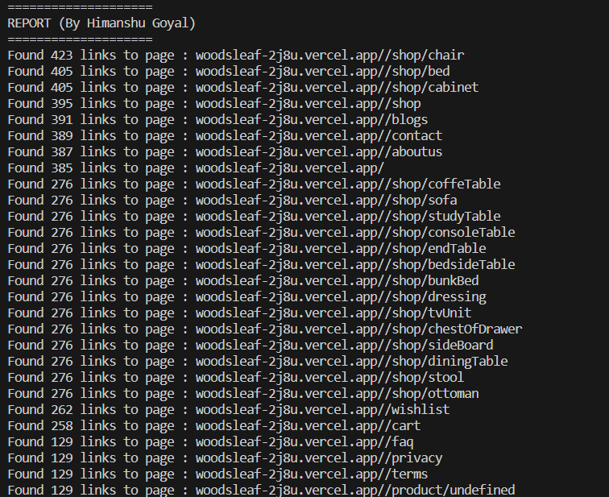

# Web Crawler (By Himanshu Goyal)

This project involves the development of a web crawler designed to provide comprehensive reports about a given website. The primary function of the crawler is to systematically explore the web pages of the target website, collate information about the links present on each page, and subsequently present this data in a sorted manner.

The core concept underlying the crawling process revolves around the utilization of a recursive function. This function systematically navigates through every link found on a webpage originating from the same hostname. During this process, the crawler accumulates the occurrence count of each link. This approach ensures a comprehensive examination of the website's internal structure, shedding light on the interconnectivity of its pages and the prevalence of different links. Ultimately, the crawler generates a report that not only showcases the link count but also provides insights into their relative frequencies.

# About Me
 - Name : Himanshu Goyal
 - University : Indian Institute of Technology (Indian school of mines), Dhanbad
 - Department : Bachelor's of technology in Electrical Engineering
 - Email : 20je0420@ee.iitism.ac.in / goyalhimanshu424@gmail.com
 - Phone : +91-74129 72658
 - Addmission Number : 20JE0420

 # Example 
 
